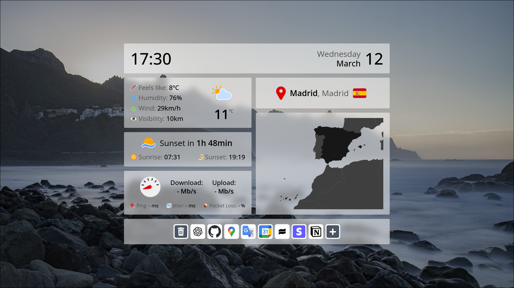
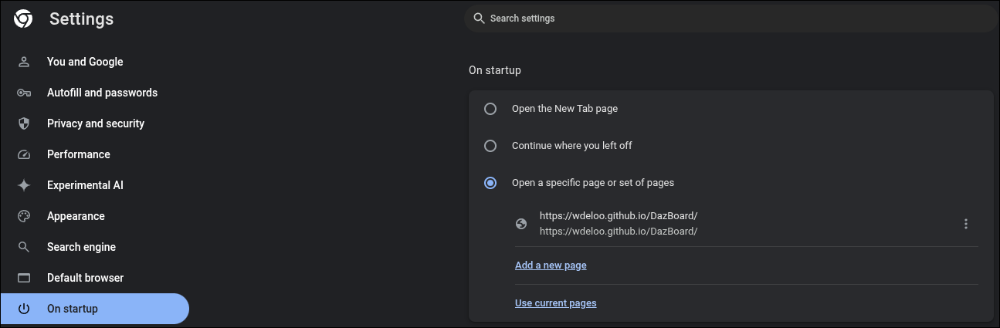
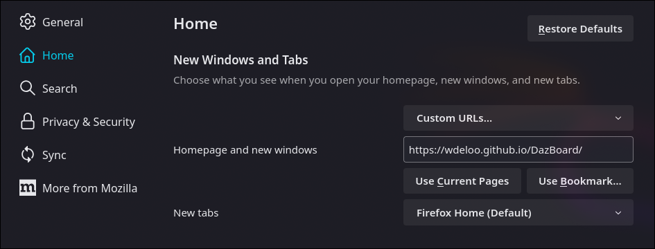

# DazBoard



**DazBoard** is a modern, **grid-style** start page for any browser, designed for those who want a comfortable and aesthetically pleasing browsing experience.

## Usage

Set as homepage the url: **https://wdeloo.github.com/DazBoard**.

* In Chrome:



* In Firefox:



## Self Hosting

1. Go to the [last release](https://github.com/wdeloo/DazBoard/releases/tag/1.0) and download the **DazBoard.zip** file.
2. Place the **compressed file** in your desired location and extract it.
3. Start an **HTTP server** in the extracted folder.

## Building from Source

1. Clone the repository to your desired location:
```
git clone https://github.com/wdeloo/DazBoard.git
cd DazBoard
```
2. Install dependencies and build the project:
```
npm install
npm run build
```
The generated static files will be in the `dist` foler.

3. Start an **HTTP server** in the `dist` folder.
